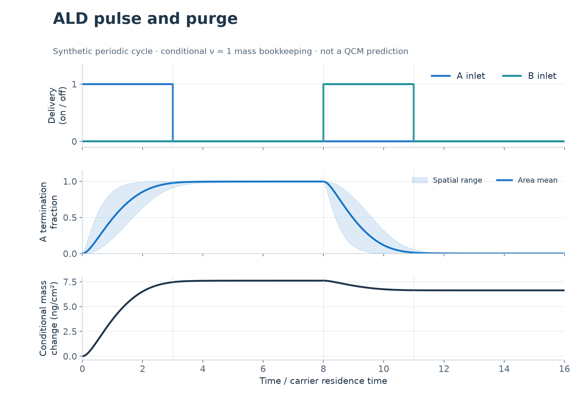
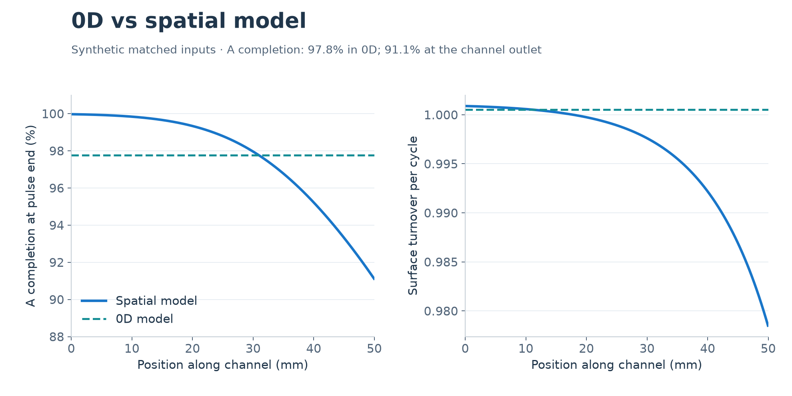
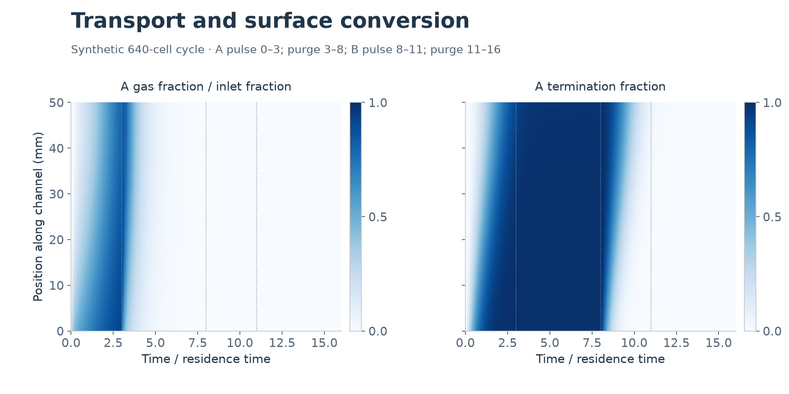
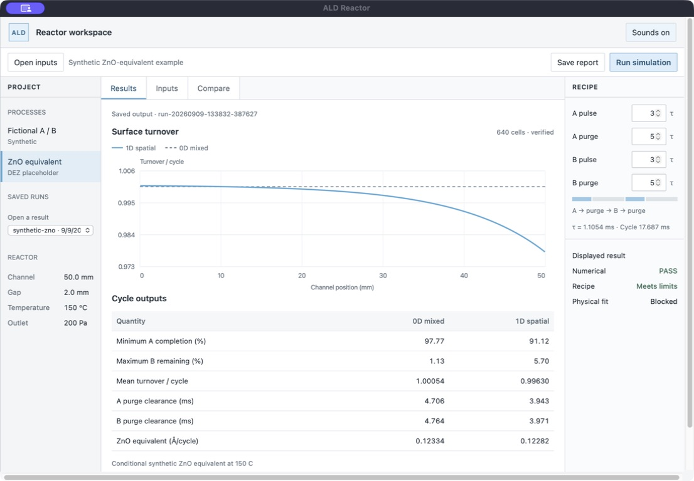

# ALD reactor digital twin

In atomic layer deposition you pulse one precursor into a reactor, purge it out,
pulse the second one, and purge again. Each cycle adds a very thin slice of film.
The hard part is knowing whether the gas actually reached the far end of the
reactor before you switched, and whether the purge really cleared it. This
project simulates that. It follows the gas and the surface through every cycle
and compares a simple well-mixed model with one that tracks the whole channel.

[Download for Mac](https://github.com/mehnajjimy/ald-reactor-digital-twin/releases/download/v1.0.0/ALD-Reactor-1.0.0-macOS-arm64.zip) · [Install guide](docs/install.md)

The app has only been tested on Apple Silicon Macs. It isn't notarized by
Apple, so macOS will block it the first time. The install guide shows how to
open it anyway.

22 Python tests · [CI](https://github.com/mehnajjimy/ald-reactor-digital-twin/actions/workflows/tests.yml) · 0D and spatial models · Mac app and CLI

Two of the examples use made-up numbers to test the math. The third, ZnO from
DEZ and water, uses published estimates plus a couple of assumptions. None of
them has been checked against real experiments yet.









These plots come from one saved simulation. The mass trace is what the model
predicts, not real QCM data. [How the figures were made](docs/readme-figures.md).

## What it shows

In this example the well-mixed model says 97.8% of the surface finishes the first
half-reaction. The channel model says only 91.1% does at the outlet. If you only
ran the simple model, you would think the recipe was fine when the far end of the
reactor was actually coming up short.

I also ran a bigger study of 63 recipe and scenario pairs. Every calculation
passed its numerical checks, but no single recipe worked in every scenario. Nine
older high-Péclet cases and one capacity point are still unverified. So the math
being right doesn't mean a working recipe exists.

## Run from source

You need Python 3.12. On macOS or Linux:

```sh
python3.12 -m venv .venv
.venv/bin/python -m pip install -r requirements-lock.txt
.venv/bin/python -m pip install --no-build-isolation --no-deps -e .
.venv/bin/ald-twin gui
```

Or run an example from the command line:

```sh
.venv/bin/ald-twin inspect synthetic-ab
OPENBLAS_NUM_THREADS=1 VECLIB_MAXIMUM_THREADS=1 .venv/bin/ald-twin simulate synthetic-ab --output runs/first-ab
.venv/bin/ald-twin compare runs/first-ab
```

The app, the CLI and the Python API all use the same solver. Every run saves its
inputs, results and a hash of the code that made them, so you can always tell
where a number came from. The fictional A/B example only reports surface
turnover, since there's no real film to convert it into.

I've only tested the Mac app on my own machine, and Windows builds aren't
verified. [Installation](docs/installation.md) and the
[desktop guide](docs/desktop-guide.md) cover setup and builds.

## The DEZ example

For a long time DEZ (diethylzinc) was just a placeholder with numbers picked to
make the math convenient. `dez-water-zno` swaps those for published estimates:

- DEZ diffuses through nitrogen at about 0.0073 m²/s at 150 °C and 200 Pa. That
  comes from Lennard-Jones values published by Zhuang et al. (2021).
- The surface holds about 6.6 zinc atoms per nm² per cycle, and the film density
  is 5.3 g/cm³. Both come from a 2026 preprint.
- How likely DEZ and water are to react when they hit the surface is a guess.
  I couldn't find a published number for either one, so the file says "assumed".

Every value lists its source and how uncertain it is. The full table is in
[the input reference](docs/input-reference.md#the-dez-and-water-estimates).

```sh
OPENBLAS_NUM_THREADS=1 VECLIB_MAXIMUM_THREADS=1 .venv/bin/ald-twin simulate dez-water-zno --output runs/dez
```

Be warned, this one takes about 13 minutes. Real DEZ diffuses around 200 times
slower than the old placeholder, so the solver needs a 20480-cell grid before
the purge timing settles down. The DEZ example is in the source code but not in
the 1.0.0 app download yet.

It predicts about 1.68 Å of ZnO per cycle, which is close to the 1.65 Å reported
at 150 °C. More interesting is that it fails the model's own wall check. In this
2 mm channel, DEZ takes too long to spread across the gap, so treating the gap as
well mixed isn't really valid anymore. The model still gives a number, but it
flags the recipe as outside the range it trusts instead of quietly passing it,
which is the behaviour I wanted.

## What's next

- A faster DEZ demo, so the app shows a result in under a minute
- Temperature dependence, so it can run below 150 °C
- Easier custom precursor inputs and documented reactor dimensions

Other films, including silicon-based ones, would each need their own chemistry
and transport checks first. For now the app is for offline simulation and
comparison.

## Guides and sources

- [Inputs](docs/input-reference.md): units, assumptions and what counts as a pass
- [Examples](docs/worked-examples.md): changing recipes and comparing saved runs
- [Code guide](docs/code-guide.md): how a calculation runs, line by line
- [Adding a process](docs/adding-a-process.md): what you can change and what you can't
- [Releases](docs/release-guide.md): builds and the update check

The code and docs are under the [MIT license](LICENSE).
[References](docs/references.md) lists the scientific sources, and
[third-party notices](THIRD_PARTY_NOTICES.md) cover dependencies and assets.
Use [CITATION.cff](CITATION.cff) if you want to cite it.
